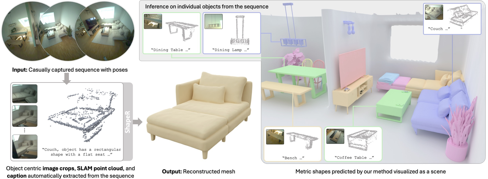

# ShapeR: Trajectory 3D Estimation Edition

[](http://facebookresearch.github.io/ShapeR)

This repository provides an end-to-end pipeline for reconstructing **metric 3D meshes** from casual handheld videos. It integrates the ShapeR flow-matching architecture with a custom SLAM-based preprocessing pipeline (SfM + DINO + SAM).

## 🚀 Quick Start (Complete Pipeline)

You can now go from a raw `.mp4` video to a 3D mesh with a single command. The pipeline automatically handles SfM, point cloud generation, and shape reconstruction.

```bash
# Full inference with text conditioning (best quality)
bash bash/run_inference.sh path/to/video.mp4

# Fast inference without text (lower VRAM, much faster)
bash bash/run_inference_text.sh path/to/video.mp4
```

## ✨ Repository Enhancements

This version of ShapeR includes several optimizations for research and production:

*   **⚡ Smart Caching**: SfM results are saved to `data/processed/*.pkl`. If you run inference on the same video again, it skips the slow SfM step.
*   **📉 VRAM Optimized**: Includes automatic model offloading logic. Use `bash/run_inference_text.sh` to run the model without the heavy T5/CLIP text encoders.
*   **🖥️ Windows & Linux Support**: Fully compatible with both Windows and Linux filesystems and CUDA configurations.
*   **🛠️ Debug Mode**: Extensive logging showing real-time Flow Matching ODE steps and VRAM usage.
*   **📂 Organized Workspace**: 
    *   `bash/`: All orchestration and setup scripts.
    *   `tests/`: Component-level and pipeline-level test scripts.
    *   `mesh_directory/`: Dedicated output folder for final `.glb` meshes.
    *   `output_shaper/`: Visualization reports (comparison images).

## 🛠️ Installation

1.  **Environment Setup**:
    ```bash
    bash bash/setup_env.sh
    conda activate shaper
    ```
2.  **Weights**: The models will automatically download on first run (requires ~15GB space).
3.  **Hugging Face (Optional)**: If using text conditioning, you may need to set your HF token:
    ```bash
    source bash/set_hf_token.sh <YOUR_TOKEN>
    ```

## 📖 Script Catalog

| Script | Purpose |
| :--- | :--- |
| `bash/run_inference.sh` | Full end-to-end video-to-mesh reconstruction. |
| `bash/run_inference_text.sh` | Skips text encoders to save ~6GB VRAM and time. |
| `bash/setup_env.sh` | Automated environment creation and dependency install. |
| `bash/test_pipeline_no_text.sh` | Rapidly test the pipeline using the latest processed cache. |
| `tests/test_vae.py` | Verify 3D VAE decoding functionality. |
| `tests/test_denoiser.py` | Verify Flow Matching weights and config. |

## 📦 Output Formats

*   **Mesh**: Saved as `.glb` in `mesh_directory/`. Perfectly scaled and oriented.
*   **Visual Report**: Saved as `VIS__*.jpg` in `output_shaper/`, showing the input images, point cloud, and reconstruction.
*   **Cache**: SfM points and camera poses saved in `data/processed/`.

---

## 🔬 Scientific Background

ShapeR introduces a novel approach to metric shape generation. It utilizes:
1.  **Metric SLAM**: Extraction of metric sparse points and poses.
2.  **VecSet Latents**: A rectified flow transformer for multimodal conditioning.
3.  **3D VAE**: Decoding latent codes into high-quality meshes.

[Project Page](http://facebookresearch.github.io/ShapeR) | [Paper](https://arxiv.org/abs/2601.11514) | [HF Evaluation Dataset](https://huggingface.co/datasets/facebook/ShapeR-Evaluation)

## 📄 License & Citation

Licensed under **CC-BY-NC**. See [LICENSE](LICENSE) for details.

```bibtex
@misc{siddiqui2026shaperrobustconditional3d,
      title={ShapeR: Robust Conditional 3D Shape Generation from Casual Captures}, 
      author={Yawar Siddiqui and others},
      year={2026},
      eprint={2601.11514},
      url={https://arxiv.org/abs/2601.11514}, 
}
```
